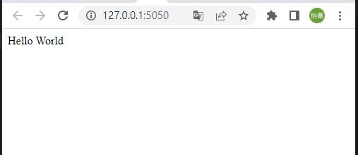
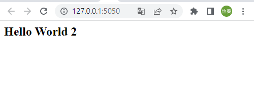

# 陳怡蓁's_Homework5 
 
## Lecture 13: IoT Flask Web (github, vs code)  
### Development EnvironmentSetup   
  
   
1.Please install vs code, register github, install git for windows   
2.github create a new repository (aiot0518)      
3.go to vs code clone this repository    
4.vs code 安裝 python extension    
5.pip install flask, pandas, sklearn   (from local)

快捷鍵 ctrl+shift+p ===> package manager 叫出 (git clone....)      
快捷鍵 ctrl+' ==> 叫出終端機   

*快捷鍵 ctrl+shift+p ===> package manager 叫出 (git clone....)        
*快捷鍵 ctrl+' ==> 叫出終端機   

### Flask Web Development   
1.(Check Point 3) simple flask web   
  *return 'hello world'   

 

  *return "hello world big font'   

    

  *return app.send_static_file('index.html')==>remenber to create static/index.html   

      

